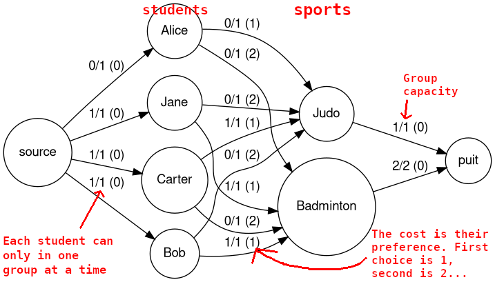

# OCaml Flow Graph Project

Functional programming course project implementing flow graph-related algorithms in OCaml.

Features:

- Depth First Search algorithm
- Dijkstra one-to-one shortest-path algorithm
- Bellman-Ford one-to-many shortest-path algorithm
- Ford-Fulkerson Max Flow algorithm
- Busacker-Gowen Max Flow Min Cost algorithm
- An application in assigning sports groups based on student preferences

## Quick tour

Optionally replace `xdg-open` with `open` or your favorite image viewer.

```bash
git clone https://github.com/ignyx/ocaml-maxflow-project.git
cd ocaml-maxflow-project

make demo graph=graph6.txt
# See the paths found by the algos

# See Ford-Fulkerson graph
dot out-ff.txt -Tpng > out.png
xdg-open out.png

# See Busacker-Gowen graph. Note that the cost is equal to the capacity.
dot out-bg.txt -Tpng > out.png
xdg-open out.png

# Run sports group assignment
make demosport
# note the INPUT DATA and RESULT

# See Flow Graph for the sports group assignment.
dot outfile-sport.graph -Tpng > out.png
xdg-open out.png

# If you'd like to see an example where second choices appear
make demosport sports_set=set3.txt
dot outfile-sport.graph -Tpng > out.png
xdg-open out.png
```

## Sports group assignement

Students must each be assigned to groups practicing different sports.
Each student can rank the sports according to their preferences.
We use this ranking as a cost to produce optimal assignments.


o

## Repo organization

```bash
.
├── fsport.exe          # Executable for the sport assignment
├── ftest.exe           # Executable for graph algos
├── graphs/             # Graphs, untouched
├── Makefile            # Cooking recipes
├── README.md
├── sports/
│   ├── set1.txt        # Small example, pleasant to view graph
│   ├── set2.txt        # Larger set with 30 students
│   └── set3.txt        # Set with 8 students
└── src
    ├── bellmanford.mli
    ├── Dfs.mli
    ├── dijkstra.mli
    ├── fsport.ml
    ├── ftest.ml
    ├── gfile.mli
    ├── graph.mli
    ├── max_flow_min_cost.mli # Busacker-Gowen
    ├── max_flow.mli          # Ford-Fulkerson
    ├── sfile.ml              # Parse Sport Assignment files
    ├── sport.mli             # Sport assignment datamodels
    └── tools.mli
```

## Makefile !

A [`Makefile`](Makefile) provides some useful commands:

- `make build` to compile. This creates an `ftest.exe` executable
- `make demo` to run the `ftest` program with some arguments
- `make format` to indent the entire project
- `make edit` to open the project in VSCode
- `make clean` to remove build artifacts

In case of trouble with the VSCode extension (e.g. the project does not build, there are strange mistakes), a common workaround is to (1) close vscode, (2) `make clean`, (3) `make build` and (4) reopen vscode (`make edit`).

## Graphviz :

Visualize the graph using the helpful `graphviz` library.

```bash
dot path/to/graphviz.txt -Tpng > out.png
```

```bash
open out.png
```
